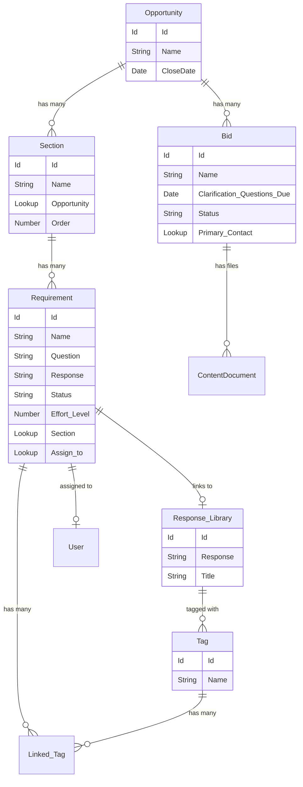

# RFX (Request for Proposal/Quote) Management System - LWC Features Documentation

## Overview
This Salesforce Lightning Web Component (LWC) application is an RFX (Request for X - Proposal, Quote, Information) management system designed to help organizations manage bid responses, questionnaires, and response libraries efficiently.

---

## 🎯 Core Features

### 1. **Response Generation & Import**
**Primary Component for Importing and Mapping RFX Documents**

**Key Features:**
- **Multi-format Document Import**
  - Support for Microsoft Word (.docx) documents
  - Support for Excel (.xlsx, .xls, .csv) spreadsheets with multi-sheet handling
  - PDF and XPS document support
  - Automatic file type detection and parsing

- **Interactive Document Mapping**
  - Visual HTML rendering of imported documents
  - Multi-sheet Excel navigation with tab controls
  - Click-to-select functionality for document elements:
    - Section selection
    - Question/Requirement selection
    - Response selection
    - ID field selection

- **Smart Content Matching**
  - Automatic mapping between document content and Salesforce records
  - Apply-to-all functionality for batch operations
  - Reset functionality for individual mapping types
  - Real-time visual feedback on selections

- **Bulk Operations**
  - Select all confirmations via confirmation dialogs
  - Mass import capabilities
  - Batch response creation

---

### 2. **Response Editor**
**Comprehensive Response Management and Editing Interface**

**Key Features:**
- **Section & Requirement Management**
  - Hierarchical navigation (Sections → Requirements)
  - Accordion-based UI for easy navigation
  - Section progress tracking:
    - Completed requirements count
    - In-progress requirements count
    - Not started requirements count
  - Filter and search capabilities

- **Response Editing**
  - Rich text editing with character and word count
  - Response status management (Not Started, In Progress, Completed)
  - Effort level tracking
  - Response versioning

- **Library Integration**
  - Add/remove responses to/from library
  - Browse existing library responses
  - Document library with file attachments
  - Knowledge article integration popup

- **Tag Management**
  - Create and assign tags to responses
  - Tag-based organization and filtering
  - Quick tag lookup and selection

- **User Assignment**
  - Assign individual users to requirements
  - Bulk user assignment across multiple requirements
  - User avatar display with photo management
  - Team collaboration features

- **Matching & Suggestions**
  - AI/Rule-based matching response selector
  - View and select from matching responses
  - Copy responses from previous bids

---

### 3. **Response Summary Dashboard**
**High-Level Overview and Export Interface**

**Key Features:**
- **Visual Dashboard**
  - Project/Opportunity branding with logo display
  - Summary information component integration
  - Summary table with section breakdowns
  - Team member avatar display

- **Action Buttons**
  - Import: Trigger import workflow
  - Run Xpress: Quick response generation
  - Respond: Open response editor
  - Export: Export responses to Excel

- **Export Capabilities**
  - Export to Excel using ExcelJS library
  - File selection modal for export source
  - Custom formatting and report generation

---

### 4. **File Management**
**Document Upload and Selection Interface**

**Key Features:**
- **File Upload Management**
  - Display all uploaded files with metadata:
    - File name and extension
    - File size (formatted: Bytes, KB, MB, GB, TB)
    - Created by user
    - Creation date
  - File type icons (Word, Excel, PDF)
  - File count display

- **File Selection Workflow**
  - Radio button selection for single file
  - File preview capabilities
  - Import/Export type differentiation
  - Next/Back navigation controls

- **Integration with Bid Selection**
  - Two-step process: File selection → Bid selection
  - Context preservation across steps
  - Enable/disable navigation based on selection

---

### 5. **Bid Management**
**Bid/Opportunity Selection and Tracking**

**Key Features:**
- **Bid Listing**
  - Data table display with columns:
    - Bid name
    - Clarification questions due date
    - Primary contact
    - Status
  - Real-time data fetching from Salesforce

- **Bid Selection**
  - Single-row selection
  - Event dispatching to parent components
  - Enable/disable next button based on selection

- **Bid Creation**
  - New bid form modal
  - Quick record creation
  - Automatic list refresh on success

---

### 6. **Summary & Reporting**
**Analytics and Progress Tracking**

**Key Features:**
- **Section Summary Table**
  - Section name with truncation for long names
  - Progress bars showing completion percentage
  - User assignments with avatars
  - Requirement counts per section
  - Click-through navigation to response editor

- **Summary Information Widget**
  - Overall statistics:
    - Total completed requirements
    - In-progress requirements
    - Not started requirements
    - Sum of effort levels
  - Tag cloud display
  - Linked categories
  - Expandable tag list with "show more" functionality

---

### 7. **Search & Lookup**
**Dynamic Search and Tag Management**

**Key Features:**
- **Dynamic Lookup**
  - Apex-powered search across any object
  - Type-ahead search functionality
  - Custom filtering support
  - Icon-based visual identification

- **Tag Management**
  - Create new tags on-the-fly (Enter key)
  - Link tags to requirements
  - Tag suggestions and autocomplete
  - Visual pill display of selected tags

- **Integration**
  - Reusable component across different contexts
  - Event-driven architecture for parent communication

---

### 8. **Matching & Suggestions**
**Intelligent Response Matching System**

**Key Features:**
- **Response Matching**
  - Fetch matching responses based on requirement ID
  - Display matched responses with selection UI
  - Select/deselect functionality
  - Empty state handling
  - Loading state management

- **Matching Type Selection**
  - Different matching algorithms
  - Option-based selector UI
  - Custom matching rules

---

### 9. **UI Components**
**Reusable UI Building Blocks**

**Key Features:**
- **Confirmation Dialog**
  - Customizable modal with title and message
  - Confirm/Cancel actions
  - Event dispatching with original context

- **Loader Success**
  - Loading state indicator
  - Success feedback animations

- **Section Response Item**
  - Individual section display component
  - Nested requirement display

- **File Selector Option**
  - Radio button file selection
  - Visual file representation

- **Matching Type Selector Option**
  - Option cards for matching algorithms
  - Visual selection feedback

---

## 🔄 Application Flow Diagrams

### Response Editing Workflow

### Component Interaction Flow

### Data Flow Architecture

---

## 📊 Key Object Relationships

---

## 🛠️ Technical Features

### JavaScript Libraries Used
1. **jQuery** - DOM manipulation and utilities
2. **Mammoth.js** - Word document (.docx) parsing
3. **XLSX / SheetJS** - Excel file parsing and generation
4. **ExcelJS** - Advanced Excel operations and export

### Salesforce Features Utilized
- **Lightning Data Service** - Record forms and data management
- **Platform Resource Loader** - Static resource loading
- **Navigation Mixin** - Page navigation
- **Toast Events** - User notifications
- **Custom Events** - Component communication
- **Wire Service** - Reactive data binding

### Design Patterns
- **Parent-Child Communication** - Custom events and public APIs
- **Separation of Concerns** - Dedicated components for specific features
- **Reusable Components** - Generic search, file selector, confirmation dialogs
- **Progressive Enhancement** - Loading states, error handling
- **State Management** - @track decorator for reactive properties

---

## 🎨 UI/UX Features

### User Experience Elements
- **Visual Feedback**
  - Loading spinners
  - Success indicators
  - Progress bars
  - Color-coded status indicators

- **Responsive Design**
  - Lightning layout system
  - Breakpoint-aware sizing
  - Mobile-friendly components

- **Accessibility**
  - ARIA labels
  - Keyboard navigation support
  - Screen reader friendly

- **Interactive Elements**
  - Hover effects
  - Click feedback
  - Drag-and-drop (potential)
  - Modal dialogs

---

## 📈 Business Value

### Efficiency Gains
1. **Time Savings**: Automated document parsing and mapping
2. **Reusability**: Response library reduces duplicate work
3. **Collaboration**: Multi-user assignment and tracking
4. **Quality**: Consistent responses using templates and library

### Management Capabilities
1. **Progress Tracking**: Real-time status and completion metrics
2. **Resource Allocation**: User assignment and effort tracking
3. **Knowledge Management**: Centralized response library
4. **Reporting**: Export capabilities for stakeholder communication

### Competitive Advantages
1. **Speed**: Faster bid response turnaround
2. **Accuracy**: Structured approach reduces errors
3. **Consistency**: Standardized responses across bids
4. **Intelligence**: Matching algorithms suggest relevant content

---

## 🔐 Security & Data Management

### Data Access
- Salesforce record-level security
- Field-level security enforcement
- Sharing rules compliance

### File Handling
- ContentDocument integration
- Secure file storage
- Version control

### User Permissions
- Profile-based access control
- User assignment tracking
- Audit trail support

---

## 🚀 Future Enhancement Opportunities

Based on the codebase analysis, potential enhancements include:

1. **AI Integration**
   - Enhanced matching algorithms
   - Natural language processing for requirements
   - Auto-response generation

2. **Advanced Analytics**
   - Bid success rate tracking
   - Response effectiveness metrics
   - Time-to-complete analytics

3. **Collaboration Features**
   - Real-time co-editing
   - Comment threads
   - Review/approval workflows

4. **Mobile Optimization**
   - Native mobile app
   - Offline capability
   - Push notifications

5. **Integration Expansion**
   - CRM integration
   - Email parsing
   - Third-party document systems

---

## 📝 Component Summary

| Component | Purpose | Key Features |
|-----------|---------|--------------|
| `response_generator` | Import & map documents | Multi-format parsing, visual mapping, bulk operations |
| `singal_response_editor` | Edit responses | Rich editing, library integration, user assignment |
| `responses_summary` | Dashboard & overview | Summary stats, export, quick actions |
| `file_selector` | File management | Upload, selection, file metadata display |
| `uploaded_file_selector` | File listing | File browser, format icons, size formatting |
| `bid_selector` | Bid selection | Data table, bid creation, selection events |
| `matching_response_selector` | Response matching | AI matching, selection UI, event dispatch |
| `response_summary_table` | Section summary | Progress tracking, user avatars, navigation |
| `reponse_summary_information` | Stats widget | Requirement counts, effort totals, tags |
| `searchComponent` | Lookup & tags | Type-ahead search, tag creation, filtering |
| `confirmationDialog` | Confirmations | Custom modal, action buttons, context passing |
| `loader_success` | Loading feedback | Visual indicators, success states |
| `section_response_item` | Section display | Individual section rendering |
| `section_response_editor_item` | Editor item | Requirement item in editor |
| `matching_type_selector` | Matching options | Algorithm selection UI |
| `util` | Utilities | Shared helper functions |

---

## 🎯 Conclusion

This RFX Management System is a comprehensive Salesforce application that streamlines the entire bid response lifecycle—from document import through response creation to export and reporting. The modular component architecture enables flexibility, maintainability, and scalability while providing users with an intuitive and efficient interface for managing complex RFX processes.

The system demonstrates strong engineering practices with reusable components, clear separation of concerns, and robust error handling, making it a solid foundation for enterprise-level bid management operations.
